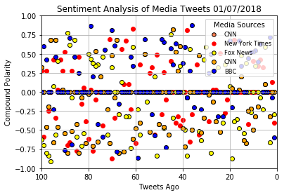

```python
# Dependencies
import tweepy
import numpy as np
import pandas as pd
import datetime
import matplotlib.pyplot as plt

# Import and Initialize Sentiment Analyzer
from vaderSentiment.vaderSentiment import SentimentIntensityAnalyzer
analyzer = SentimentIntensityAnalyzer()

# Twitter API Keys
consumer_key = "evHVYPKDjAJ0JAitpY49z7KJ4"
consumer_secret = "MpG65nQZOuf0ErIyEtaUDPA0J8aI2qIdGRcbeLmgIpXuOXbCKM"
access_token = "979169626012631041-vEFBfFZ1FCam3j9lRdqcMwn27aA2puX"
access_token_secret = "I1AJRehHaXYZbfuYs1x64hVth0nzKALMhMLxOjU2pkSmN"

# Setup Tweepy API Authentication
auth = tweepy.OAuthHandler(consumer_key, consumer_secret)
auth.set_access_token(access_token, access_token_secret)
api = tweepy.API(auth, parser=tweepy.parsers.JSONParser())
```


```python
# Target User Accounts
target_user = ("@BBC", "@CBS", "@CNN", "@FoxNews", "@nytimes")
tweet_scores = []
results_list =[]


tweets_counter = []
compound_tweet = []
username = []


# Loop through each user
for user in target_user:
        # Loop through 10 pages of tweets (total 200 tweets)

    counter = 1
    oldest_tweet = None
    # Loop through 10 pages of tweets (total 200 tweets)
    for x in range(10):
     
    
        # Get all tweets from home feed
        public_tweets = api.user_timeline(user, max_id = oldest_tweet )

        # Loop through all tweets
        for tweet in public_tweets:

            # Run Vader Analysis on each tweet
            results = analyzer.polarity_scores(tweet["text"])
            compound = results["compound"]
            tweets_ago = counter

            # Add each value to the appropriate list
            compound_tweet.append(compound)
            tweets_counter.append(counter)
            username.append(user)
            
            oldest_tweet= tweet['id']-1
            counter += 1
            
        mean_compound = np.mean(compound_tweet)
        results_list.append(mean_compound)
            
# Create a dictionaty of results
user_results = {
    "Username": username,
    "Compound Score": compound_tweet,
    "Tweets ago": tweets_counter
}

tweets=pd.DataFrame(user_results)
tweets


```


<div>
<style>
    .dataframe thead tr:only-child th {
        text-align: right;
    }

    .dataframe thead th {
        text-align: left;
    }

    .dataframe tbody tr th {
        vertical-align: top;
    }
</style>
<table border="1" class="dataframe">
  <thead>
    <tr style="text-align: right;">
      <th></th>
      <th>Compound Score</th>
      <th>Tweets ago</th>
      <th>Username</th>
    </tr>
  </thead>
  <tbody>
    <tr>
      <th>0</th>
      <td>-0.5994</td>
      <td>1</td>
      <td>@BBC</td>
    </tr>
    <tr>
      <th>1</th>
      <td>-0.0772</td>
      <td>2</td>
      <td>@BBC</td>
    </tr>
    <tr>
      <th>2</th>
      <td>0.7184</td>
      <td>3</td>
      <td>@BBC</td>
    </tr>
    <tr>
      <th>3</th>
      <td>0.0000</td>
      <td>4</td>
      <td>@BBC</td>
    </tr>
    <tr>
      <th>4</th>
      <td>0.0000</td>
      <td>5</td>
      <td>@BBC</td>
    </tr>
    <tr>
      <th>5</th>
      <td>0.0000</td>
      <td>6</td>
      <td>@BBC</td>
    </tr>
    <tr>
      <th>6</th>
      <td>0.6239</td>
      <td>7</td>
      <td>@BBC</td>
    </tr>
    <tr>
      <th>7</th>
      <td>0.4003</td>
      <td>8</td>
      <td>@BBC</td>
    </tr>
    <tr>
      <th>8</th>
      <td>0.5411</td>
      <td>9</td>
      <td>@BBC</td>
    </tr>
    <tr>
      <th>9</th>
      <td>0.5267</td>
      <td>10</td>
      <td>@BBC</td>
    </tr>
    <tr>
      <th>10</th>
      <td>0.5267</td>
      <td>11</td>
      <td>@BBC</td>
    </tr>
    <tr>
      <th>11</th>
      <td>0.4404</td>
      <td>12</td>
      <td>@BBC</td>
    </tr>
    <tr>
      <th>12</th>
      <td>0.0000</td>
      <td>13</td>
      <td>@BBC</td>
    </tr>
    <tr>
      <th>13</th>
      <td>0.0000</td>
      <td>14</td>
      <td>@BBC</td>
    </tr>
    <tr>
      <th>14</th>
      <td>0.3400</td>
      <td>15</td>
      <td>@BBC</td>
    </tr>
    <tr>
      <th>15</th>
      <td>0.6705</td>
      <td>16</td>
      <td>@BBC</td>
    </tr>
    <tr>
      <th>16</th>
      <td>0.0000</td>
      <td>17</td>
      <td>@BBC</td>
    </tr>
    <tr>
      <th>17</th>
      <td>0.0000</td>
      <td>18</td>
      <td>@BBC</td>
    </tr>
    <tr>
      <th>18</th>
      <td>-0.2023</td>
      <td>19</td>
      <td>@BBC</td>
    </tr>
    <tr>
      <th>19</th>
      <td>0.6757</td>
      <td>20</td>
      <td>@BBC</td>
    </tr>
    <tr>
      <th>20</th>
      <td>0.0000</td>
      <td>21</td>
      <td>@BBC</td>
    </tr>
    <tr>
      <th>21</th>
      <td>0.0000</td>
      <td>22</td>
      <td>@BBC</td>
    </tr>
    <tr>
      <th>22</th>
      <td>-0.3252</td>
      <td>23</td>
      <td>@BBC</td>
    </tr>
    <tr>
      <th>23</th>
      <td>0.0000</td>
      <td>24</td>
      <td>@BBC</td>
    </tr>
    <tr>
      <th>24</th>
      <td>-0.3182</td>
      <td>25</td>
      <td>@BBC</td>
    </tr>
    <tr>
      <th>25</th>
      <td>0.0000</td>
      <td>26</td>
      <td>@BBC</td>
    </tr>
    <tr>
      <th>26</th>
      <td>0.0000</td>
      <td>27</td>
      <td>@BBC</td>
    </tr>
    <tr>
      <th>27</th>
      <td>0.4939</td>
      <td>28</td>
      <td>@BBC</td>
    </tr>
    <tr>
      <th>28</th>
      <td>0.2500</td>
      <td>29</td>
      <td>@BBC</td>
    </tr>
    <tr>
      <th>29</th>
      <td>0.0000</td>
      <td>30</td>
      <td>@BBC</td>
    </tr>
    <tr>
      <th>...</th>
      <td>...</td>
      <td>...</td>
      <td>...</td>
    </tr>
    <tr>
      <th>970</th>
      <td>0.0258</td>
      <td>171</td>
      <td>@nytimes</td>
    </tr>
    <tr>
      <th>971</th>
      <td>0.3724</td>
      <td>172</td>
      <td>@nytimes</td>
    </tr>
    <tr>
      <th>972</th>
      <td>0.2732</td>
      <td>173</td>
      <td>@nytimes</td>
    </tr>
    <tr>
      <th>973</th>
      <td>0.4215</td>
      <td>174</td>
      <td>@nytimes</td>
    </tr>
    <tr>
      <th>974</th>
      <td>0.0000</td>
      <td>175</td>
      <td>@nytimes</td>
    </tr>
    <tr>
      <th>975</th>
      <td>-0.3400</td>
      <td>176</td>
      <td>@nytimes</td>
    </tr>
    <tr>
      <th>976</th>
      <td>0.0000</td>
      <td>177</td>
      <td>@nytimes</td>
    </tr>
    <tr>
      <th>977</th>
      <td>0.0000</td>
      <td>178</td>
      <td>@nytimes</td>
    </tr>
    <tr>
      <th>978</th>
      <td>-0.4588</td>
      <td>179</td>
      <td>@nytimes</td>
    </tr>
    <tr>
      <th>979</th>
      <td>-0.4404</td>
      <td>180</td>
      <td>@nytimes</td>
    </tr>
    <tr>
      <th>980</th>
      <td>0.6124</td>
      <td>181</td>
      <td>@nytimes</td>
    </tr>
    <tr>
      <th>981</th>
      <td>0.6124</td>
      <td>182</td>
      <td>@nytimes</td>
    </tr>
    <tr>
      <th>982</th>
      <td>-0.6486</td>
      <td>183</td>
      <td>@nytimes</td>
    </tr>
    <tr>
      <th>983</th>
      <td>0.1280</td>
      <td>184</td>
      <td>@nytimes</td>
    </tr>
    <tr>
      <th>984</th>
      <td>-0.8625</td>
      <td>185</td>
      <td>@nytimes</td>
    </tr>
    <tr>
      <th>985</th>
      <td>0.0000</td>
      <td>186</td>
      <td>@nytimes</td>
    </tr>
    <tr>
      <th>986</th>
      <td>0.0000</td>
      <td>187</td>
      <td>@nytimes</td>
    </tr>
    <tr>
      <th>987</th>
      <td>0.3612</td>
      <td>188</td>
      <td>@nytimes</td>
    </tr>
    <tr>
      <th>988</th>
      <td>0.0000</td>
      <td>189</td>
      <td>@nytimes</td>
    </tr>
    <tr>
      <th>989</th>
      <td>0.2732</td>
      <td>190</td>
      <td>@nytimes</td>
    </tr>
    <tr>
      <th>990</th>
      <td>0.0000</td>
      <td>191</td>
      <td>@nytimes</td>
    </tr>
    <tr>
      <th>991</th>
      <td>0.0258</td>
      <td>192</td>
      <td>@nytimes</td>
    </tr>
    <tr>
      <th>992</th>
      <td>-0.3939</td>
      <td>193</td>
      <td>@nytimes</td>
    </tr>
    <tr>
      <th>993</th>
      <td>0.0000</td>
      <td>194</td>
      <td>@nytimes</td>
    </tr>
    <tr>
      <th>994</th>
      <td>-0.3182</td>
      <td>195</td>
      <td>@nytimes</td>
    </tr>
    <tr>
      <th>995</th>
      <td>0.3612</td>
      <td>196</td>
      <td>@nytimes</td>
    </tr>
    <tr>
      <th>996</th>
      <td>0.3612</td>
      <td>197</td>
      <td>@nytimes</td>
    </tr>
    <tr>
      <th>997</th>
      <td>-0.3818</td>
      <td>198</td>
      <td>@nytimes</td>
    </tr>
    <tr>
      <th>998</th>
      <td>0.0000</td>
      <td>199</td>
      <td>@nytimes</td>
    </tr>
    <tr>
      <th>999</th>
      <td>-0.5849</td>
      <td>200</td>
      <td>@nytimes</td>
    </tr>
  </tbody>
</table>
<p>1000 rows × 3 columns</p>
</div>


```python
# Plot Time Between Tweets
user_cnn = tweets[tweets["Username"]== "@CNN"]
user_nytimes = tweets[tweets["Username"]== "@nytimes"]
user_foxnews = tweets[tweets["Username"]== "@FoxNews"]
user_cbs = tweets[tweets["Username"]== "@CBS"]
user_bbc = tweets[tweets["Username"]== "@BBC"]

cnn_x_vals = user_cnn["Tweets ago"]
cnn_y_vals = user_cnn["Compound Score"]
nytimes_x_vals = user_nytimes["Tweets ago"]
nytimes_y_vals = user_nytimes["Compound Score"]
foxnews_x_vals = user_foxnews["Tweets ago"]
foxnews_y_vals = user_foxnews["Compound Score"]
cbs_x_vals = user_cbs["Tweets ago"]
cbs_y_vals = user_cbs["Compound Score"]
bbc_x_vals = user_bbc["Tweets ago"]
bbc_y_vals = user_bbc["Compound Score"]

plt.scatter(cnn_x_vals, cnn_y_vals,
           c="coral", edgecolor="black", linewidths = 1, marker="o",label="CNN")
plt.scatter(nytimes_x_vals,nytimes_y_vals,c="red", linewidths = 1, marker = "o", label="New York Times")
plt.scatter(foxnews_x_vals, foxnews_y_vals,
           c="yellow", edgecolor="black", linewidths = 1, marker="o",label="Fox News")
plt.scatter(cbs_x_vals, cnn_y_vals,
           c="orange", edgecolor="black", linewidths = 1, marker="o",label="CNN")
plt.scatter(bbc_x_vals, bbc_y_vals,
           c="blue", edgecolor="black", linewidths = 1, marker="o",label="BBC")

plt.title("Sentiment Analysis of Media Tweets 01/07/2018")
plt.xlabel("Tweets Ago")
plt.ylabel("Compound Polarity")
plt.grid(True)
plt.ylim(-1, 1)
plt.xlim(100,0)

# Create a legend
lgnd = plt.legend(fontsize="small", mode="Expanded", 
                  numpoints=1, scatterpoints=1, 
                  loc="best", title="Media Sources",
                  labelspacing=0.5)
lgnd.legendHandles[0]._sizes = [30]
lgnd.legendHandles[1]._sizes = [30]
lgnd.legendHandles[2]._sizes = [30]

plt.show()
```





```python
# Create DataFrame from Results List
tweets = pd.DataFrame(user_results).set_index("Username").round(3)
tweets
```


<div>
<style>
    .dataframe thead tr:only-child th {
        text-align: right;
    }

    .dataframe thead th {
        text-align: left;
    }

    .dataframe tbody tr th {
        vertical-align: top;
    }
</style>
<table border="1" class="dataframe">
  <thead>
    <tr style="text-align: right;">
      <th></th>
      <th>Compound Score</th>
      <th>Tweets ago</th>
    </tr>
    <tr>
      <th>Username</th>
      <th></th>
      <th></th>
    </tr>
  </thead>
  <tbody>
    <tr>
      <th>@BBC</th>
      <td>-0.599</td>
      <td>1</td>
    </tr>
    <tr>
      <th>@BBC</th>
      <td>-0.077</td>
      <td>2</td>
    </tr>
    <tr>
      <th>@BBC</th>
      <td>0.718</td>
      <td>3</td>
    </tr>
    <tr>
      <th>@BBC</th>
      <td>0.000</td>
      <td>4</td>
    </tr>
    <tr>
      <th>@BBC</th>
      <td>0.000</td>
      <td>5</td>
    </tr>
    <tr>
      <th>@BBC</th>
      <td>0.000</td>
      <td>6</td>
    </tr>
    <tr>
      <th>@BBC</th>
      <td>0.624</td>
      <td>7</td>
    </tr>
    <tr>
      <th>@BBC</th>
      <td>0.400</td>
      <td>8</td>
    </tr>
    <tr>
      <th>@BBC</th>
      <td>0.541</td>
      <td>9</td>
    </tr>
    <tr>
      <th>@BBC</th>
      <td>0.527</td>
      <td>10</td>
    </tr>
    <tr>
      <th>@BBC</th>
      <td>0.527</td>
      <td>11</td>
    </tr>
    <tr>
      <th>@BBC</th>
      <td>0.440</td>
      <td>12</td>
    </tr>
    <tr>
      <th>@BBC</th>
      <td>0.000</td>
      <td>13</td>
    </tr>
    <tr>
      <th>@BBC</th>
      <td>0.000</td>
      <td>14</td>
    </tr>
    <tr>
      <th>@BBC</th>
      <td>0.340</td>
      <td>15</td>
    </tr>
    <tr>
      <th>@BBC</th>
      <td>0.670</td>
      <td>16</td>
    </tr>
    <tr>
      <th>@BBC</th>
      <td>0.000</td>
      <td>17</td>
    </tr>
    <tr>
      <th>@BBC</th>
      <td>0.000</td>
      <td>18</td>
    </tr>
    <tr>
      <th>@BBC</th>
      <td>-0.202</td>
      <td>19</td>
    </tr>
    <tr>
      <th>@BBC</th>
      <td>0.676</td>
      <td>20</td>
    </tr>
    <tr>
      <th>@BBC</th>
      <td>0.000</td>
      <td>21</td>
    </tr>
    <tr>
      <th>@BBC</th>
      <td>0.000</td>
      <td>22</td>
    </tr>
    <tr>
      <th>@BBC</th>
      <td>-0.325</td>
      <td>23</td>
    </tr>
    <tr>
      <th>@BBC</th>
      <td>0.000</td>
      <td>24</td>
    </tr>
    <tr>
      <th>@BBC</th>
      <td>-0.318</td>
      <td>25</td>
    </tr>
    <tr>
      <th>@BBC</th>
      <td>0.000</td>
      <td>26</td>
    </tr>
    <tr>
      <th>@BBC</th>
      <td>0.000</td>
      <td>27</td>
    </tr>
    <tr>
      <th>@BBC</th>
      <td>0.494</td>
      <td>28</td>
    </tr>
    <tr>
      <th>@BBC</th>
      <td>0.250</td>
      <td>29</td>
    </tr>
    <tr>
      <th>@BBC</th>
      <td>0.000</td>
      <td>30</td>
    </tr>
    <tr>
      <th>...</th>
      <td>...</td>
      <td>...</td>
    </tr>
    <tr>
      <th>@nytimes</th>
      <td>0.026</td>
      <td>171</td>
    </tr>
    <tr>
      <th>@nytimes</th>
      <td>0.372</td>
      <td>172</td>
    </tr>
    <tr>
      <th>@nytimes</th>
      <td>0.273</td>
      <td>173</td>
    </tr>
    <tr>
      <th>@nytimes</th>
      <td>0.422</td>
      <td>174</td>
    </tr>
    <tr>
      <th>@nytimes</th>
      <td>0.000</td>
      <td>175</td>
    </tr>
    <tr>
      <th>@nytimes</th>
      <td>-0.340</td>
      <td>176</td>
    </tr>
    <tr>
      <th>@nytimes</th>
      <td>0.000</td>
      <td>177</td>
    </tr>
    <tr>
      <th>@nytimes</th>
      <td>0.000</td>
      <td>178</td>
    </tr>
    <tr>
      <th>@nytimes</th>
      <td>-0.459</td>
      <td>179</td>
    </tr>
    <tr>
      <th>@nytimes</th>
      <td>-0.440</td>
      <td>180</td>
    </tr>
    <tr>
      <th>@nytimes</th>
      <td>0.612</td>
      <td>181</td>
    </tr>
    <tr>
      <th>@nytimes</th>
      <td>0.612</td>
      <td>182</td>
    </tr>
    <tr>
      <th>@nytimes</th>
      <td>-0.649</td>
      <td>183</td>
    </tr>
    <tr>
      <th>@nytimes</th>
      <td>0.128</td>
      <td>184</td>
    </tr>
    <tr>
      <th>@nytimes</th>
      <td>-0.862</td>
      <td>185</td>
    </tr>
    <tr>
      <th>@nytimes</th>
      <td>0.000</td>
      <td>186</td>
    </tr>
    <tr>
      <th>@nytimes</th>
      <td>0.000</td>
      <td>187</td>
    </tr>
    <tr>
      <th>@nytimes</th>
      <td>0.361</td>
      <td>188</td>
    </tr>
    <tr>
      <th>@nytimes</th>
      <td>0.000</td>
      <td>189</td>
    </tr>
    <tr>
      <th>@nytimes</th>
      <td>0.273</td>
      <td>190</td>
    </tr>
    <tr>
      <th>@nytimes</th>
      <td>0.000</td>
      <td>191</td>
    </tr>
    <tr>
      <th>@nytimes</th>
      <td>0.026</td>
      <td>192</td>
    </tr>
    <tr>
      <th>@nytimes</th>
      <td>-0.394</td>
      <td>193</td>
    </tr>
    <tr>
      <th>@nytimes</th>
      <td>0.000</td>
      <td>194</td>
    </tr>
    <tr>
      <th>@nytimes</th>
      <td>-0.318</td>
      <td>195</td>
    </tr>
    <tr>
      <th>@nytimes</th>
      <td>0.361</td>
      <td>196</td>
    </tr>
    <tr>
      <th>@nytimes</th>
      <td>0.361</td>
      <td>197</td>
    </tr>
    <tr>
      <th>@nytimes</th>
      <td>-0.382</td>
      <td>198</td>
    </tr>
    <tr>
      <th>@nytimes</th>
      <td>0.000</td>
      <td>199</td>
    </tr>
    <tr>
      <th>@nytimes</th>
      <td>-0.585</td>
      <td>200</td>
    </tr>
  </tbody>
</table>
<p>1000 rows × 2 columns</p>
</div>


```python
compound_gb = tweets.groupby(["Username"])["Compound Score"].mean()
compound_bar=pd.DataFrame(compound_gb)

colors = ["blue", "grey", "darkgrey", "grey"]
compound_bar.plot(kind="bar", figsize=(10,5), color=colors)

plt.title("Overall Media Sentiment on Twitter 4/9/18")
plt.xlabel("News Company")
plt.ylabel("Average Compound Sentiment Score")

plt.show()
```


```python
tweets.to_csv("compound_tweet.csv", index=False, header=True)       
```
